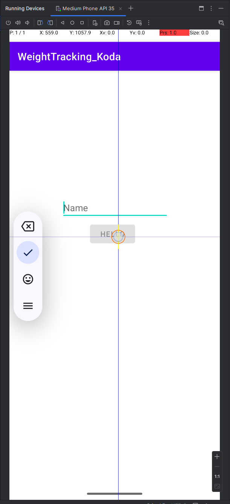
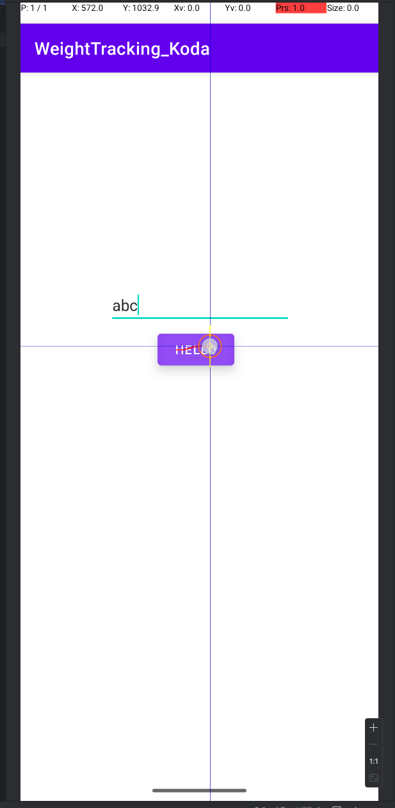
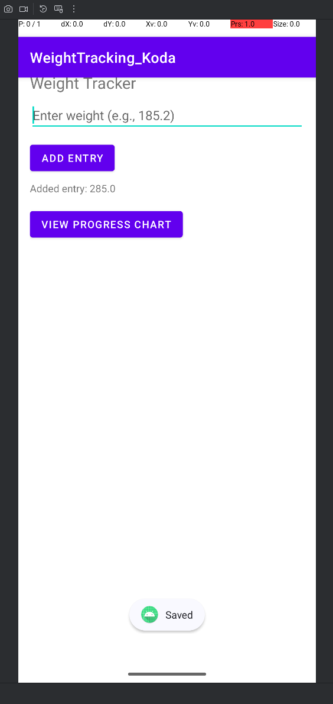

# CS360 Weight Tracker Application — Software Engineering & Design

## Description
This artifact is my **CS360 Weight Tracker Android application**. The original version allowed users to enter weight values and see basic UI responses. It was built in Java using Android Studio and designed as a lightweight personal tool. While functional, the initial build had limited validation, lacked persistence, and offered minimal user value beyond raw input.

For the enhancement, I focused on applying **software engineering and design principles** to improve usability, reliability, and maintainability. I added robust input validation, persistent storage, and a data visualization feature, transforming the application into a more practical and user-friendly tool.

## Original Code
- Path in this repo: [`code/original/Koda_Ermini_WeightTracker_ProjectThree.zip`](../code/original/Koda_Ermini_WeightTracker_ProjectThree.zip)

## Enhanced Code
- Path in this repo: [`code/enhanced/Koda_Ermini_WeightTracker_ProjectThree_ENHANCED.zip`](../code/enhanced/Koda_Ermini_WeightTracker_ProjectThree_ENHANCED.zip)

## Enhancement Narrative
I selected this artifact because mobile applications are an excellent way to demonstrate skills in **UI/UX design**, **input validation**, **state persistence**, and **defensive programming**. The enhancements illustrate my ability to design with end-users in mind, write maintainable code, and incorporate practical features that improve user experience.

Enhancements performed:  
1. **Input Validation** – The original version accepted empty and invalid inputs. I implemented checks that block empty, nonnumeric, or unrealistic values, and provide inline error messages for clarity.  
2. **Progress Chart** – I integrated a charting library to display a line graph of weight entries over time, adding a dedicated screen that transforms raw entries into meaningful visual feedback.  
3. **Persistence** – Weight entries are now saved using SharedPreferences with JSON serialization. This ensures data persists between sessions while keeping the design lightweight. I also documented a migration path to Room/SQLite for future scalability.

### Reflection
Enhancing this artifact required balancing scope and user value. SharedPreferences was chosen for persistence due to its simplicity and alignment with the project’s scale, but I considered scalability in the design. Input validation presented challenges in covering realistic ranges and producing helpful error messages, but the result increased reliability and reduced vulnerabilities. The new progress chart demonstrated my ability to integrate third-party libraries and provide valuable insights to users. Overall, the enhancements reinforced my ability to apply software engineering practices to create robust, user-focused applications.

## Evidence & Screenshots

### Original Version
- Allowed empty inputs without error  

- Allowed invalid inputs without validation  

- Missing click listener, no interaction in Logcat  
  

### Enhanced Version
- Input validation ensures realistic values  

- Successful entry confirmation displayed  

- Weight entries visualized in a progress chart  

## Course Outcomes Addressed
- **Design and deliver professional-quality software** by applying structured design principles, improving maintainability, and enhancing usability.  
- **Develop a security mindset** through robust input validation and defensive programming practices to prevent bad or malicious data.  
- **Communicate design decisions effectively** by incorporating UI feedback, inline documentation, and structured error handling that makes the software easier to understand and use.  
