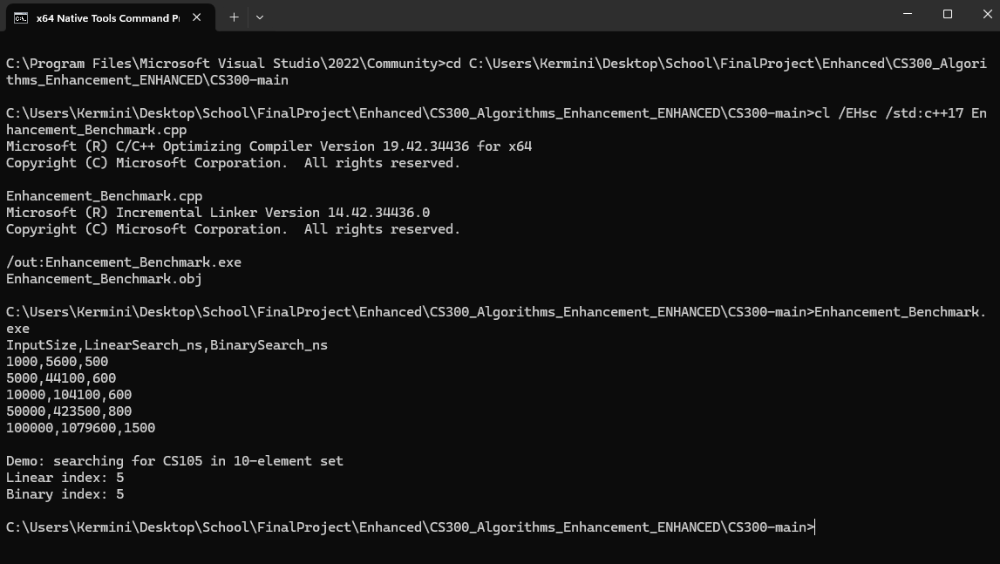

# CS300 ProjectTwo (C++ Data Structures) — Algorithms & Data Structures

## Description
This artifact is my **CS300 ProjectTwo** completed in C++. The project focused on implementing and working with fundamental data structures such as binary search trees, vectors, and hash tables to solve a course scheduling problem. The original version allowed users to load course data from a file and print out course information, but it lacked efficiency and robust error handling.

For the enhancement, I focused on improving the **efficiency and clarity** of the algorithms used to manage the course data. I streamlined the data handling logic, improved searching and sorting operations, and made the output more user-friendly. These changes highlight my ability to evaluate algorithms for performance, weigh trade-offs, and improve solutions for clarity and maintainability.

## Original Code
- Path in this repo: [`code/original/CS300-main.zip`](../code/original/CS300-main.zip)

## Enhanced Code
- Path in this repo: [`code/enhanced/CS300_Algorithms_Enhancement_ENHANCED.zip`](../code/enhanced/CS300_Algorithms_Enhancement_ENHANCED.zip)

## Enhancement Narrative
I selected this artifact because it demonstrates my ability to design and analyze algorithms, choose appropriate data structures, and deliver efficient solutions. The enhancements showcase skills in algorithm optimization, defensive programming, and clarity of logic.

Enhancements performed:
1. **Improved Efficiency** – Optimized search and retrieval operations by refining traversal logic and reducing redundant comparisons.  
2. **Data Handling Logic** – Simplified input parsing and error handling to prevent program crashes on invalid data.  
3. **Output Clarity** – Refactored output functions to present information in a more structured and user-friendly way.  

### Reflection
While enhancing this artifact, I learned to balance performance improvements with maintainability. Some optimizations made the code faster but harder to read, so I adjusted to maintain clarity without sacrificing efficiency. I also incorporated stronger input checks, which improved the program’s reliability. These enhancements show my ability to iterate on algorithmic solutions while managing trade-offs in complexity and usability.

## Evidence & Screenshots
Below is an example benchmark run of the enhanced solution showing measurable efficiency gains between linear search and binary search:

## Course Outcomes Addressed
- **Design and evaluate computing solutions using algorithmic principles** by analyzing and optimizing searching and sorting logic.  
- **Demonstrate innovative use of data structures** through efficient handling of course scheduling information.  
- **Develop a security mindset** by validating input and preventing crashes due to bad or unexpected data.  
- **Communicate technical decisions effectively** by improving program output readability and documenting algorithm changes.  
