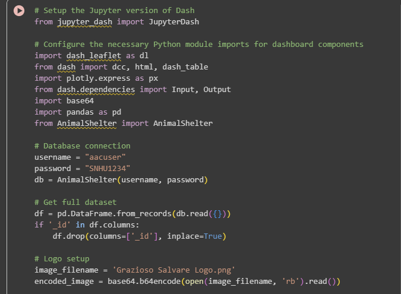
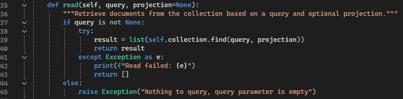
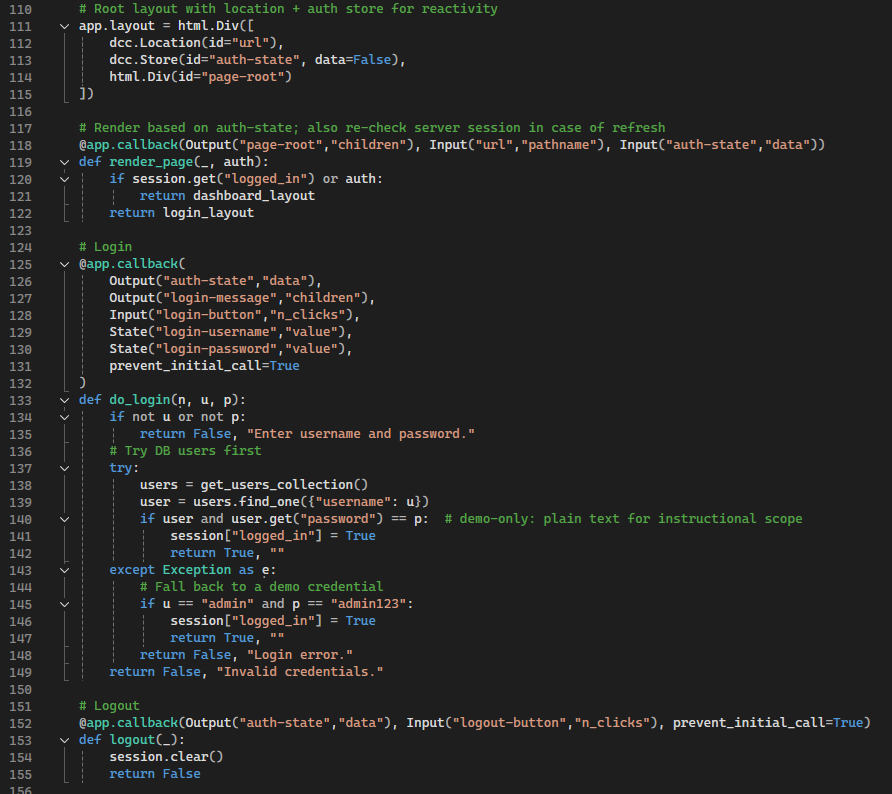
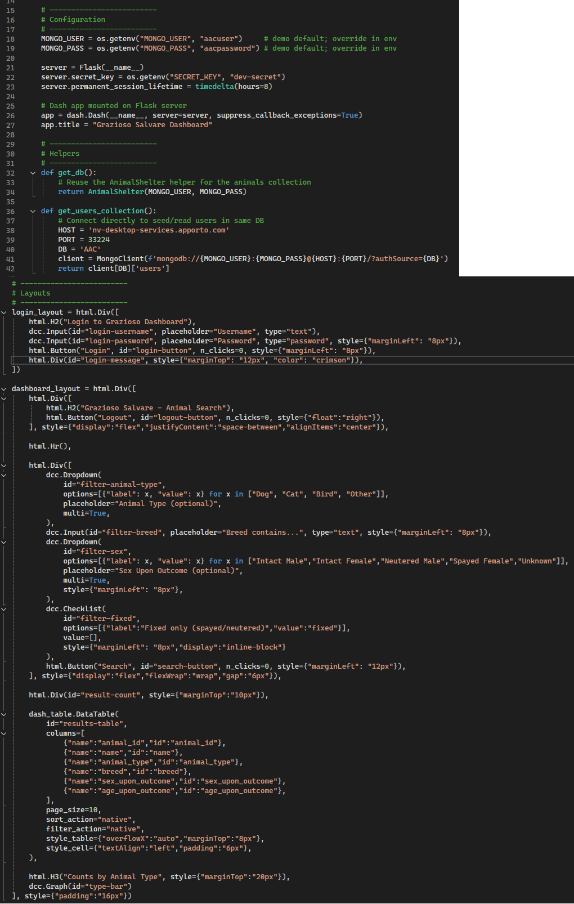

# CS340 MongoDB Dashboard — Databases

## Description
This artifact is my **CS340 MongoDB Dashboard project**, originally created in Python using **Flask, Dash, and MongoDB**. The goal was to provide an interactive dashboard for Grazioso Salvare, allowing users to query and visualize data about animals in shelters.  

The original version was functional but had some limitations. It used hardcoded database credentials, lacked authentication, and had limited query flexibility. These issues restricted both usability and security, leaving the project as more of a proof-of-concept than a production-ready tool.

For the enhancement, I focused on **security**, **user authentication**, and **data interactivity**. The upgraded version implemented a login system, parameterized database queries, and improved UI components for filtering and displaying results.

## Original Code
- Path in this repo: [`code/original/cs340-final-dashboard-main.zip`](../code/original/cs340-final-dashboard-main.zip)

## Enhanced Code
- Path in this repo: [`code/enhanced/CS340_Database_Enhancement_ENHANCED.zip`](../code/enhanced/CS340_Database_Enhancement_ENHANCED.zip)

## Enhancement Narrative
I chose this artifact because it demonstrates my ability to integrate **databases** with real-time applications, focusing on both security and usability. Databases are central to computer science practice, and this project highlights the importance of secure authentication, clean data queries, and clear visualization.  

Enhancements performed:
1. **Authentication System** – Added a login screen that validates credentials from a MongoDB users collection, replacing insecure hardcoded credentials.  
2. **Query Filtering** – Implemented dropdown and checkbox filters for species, breed, and sex, allowing users to customize search results.  
3. **Improved Layouts** – Refined the Dash UI for clearer separation of login and dashboard states, ensuring smoother navigation.  
4. **Defensive Programming** – Strengthened error handling in database queries and provided user-friendly error messages instead of silent failures.  

### Reflection
This enhancement taught me how to integrate authentication into a data dashboard while preserving usability. I balanced simplicity with security by using MongoDB collections for credential storage and session-based state in Dash. Query filters transformed the project from a static viewer into an interactive analytical tool. Overall, the project now resembles a real-world dashboard application, applying both technical skills and a security mindset.

## Evidence & Screenshots
Below are examples highlighting the changes:  

**Original (hardcoded login & limited query)**  
  
  

**Enhanced (authentication, filters, and improved UI)**  
  
  

## Course Outcomes Addressed
- **Employ strategies for building collaborative environments** by structuring code into clear modules for future team extension.  
- **Design and evaluate computing solutions using algorithmic principles** by building efficient database queries and handling large datasets.  
- **Demonstrate innovative techniques, skills, and tools in computing practices** by integrating MongoDB with Dash/Flask for interactive data visualization.  
- **Develop a security mindset** by replacing hardcoded credentials with authenticated user logins and by validating user inputs.  
- **Communicate effectively** through structured UI design and improved error feedback, making the system understandable for non-technical stakeholders.  
